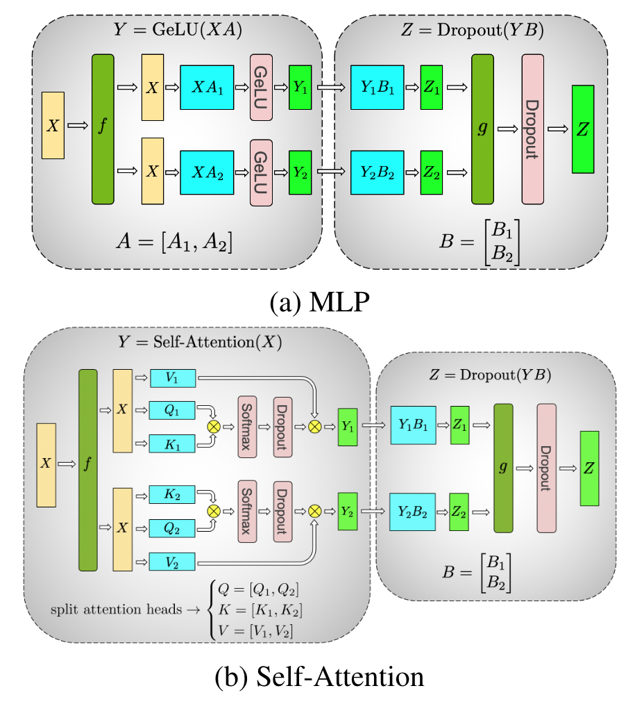
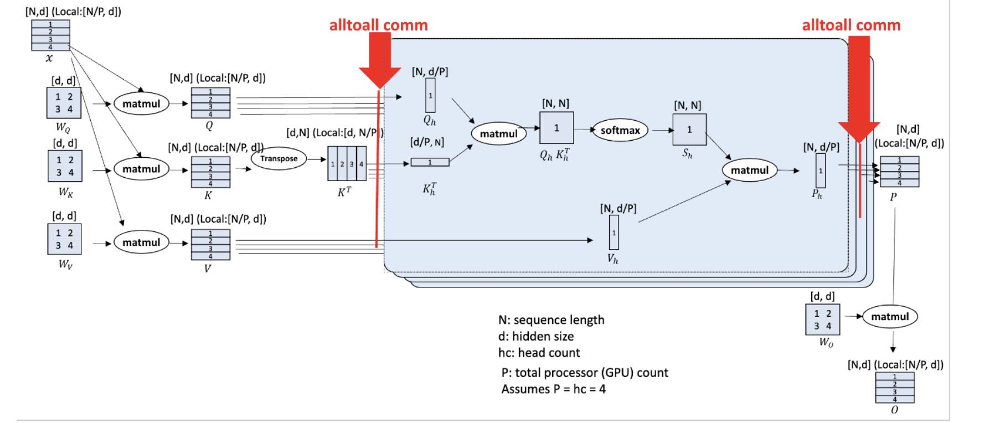
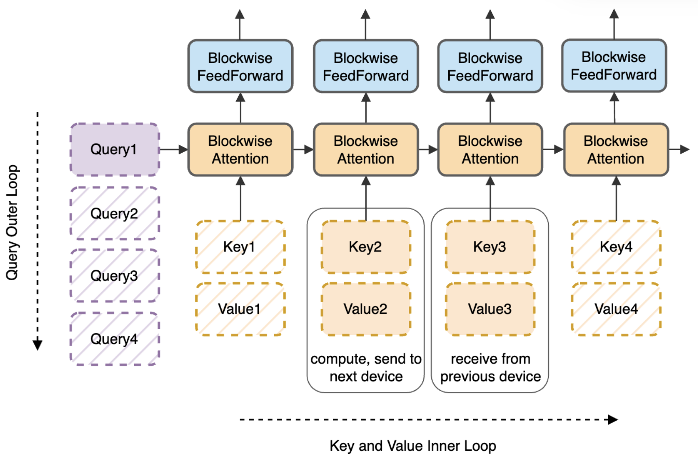
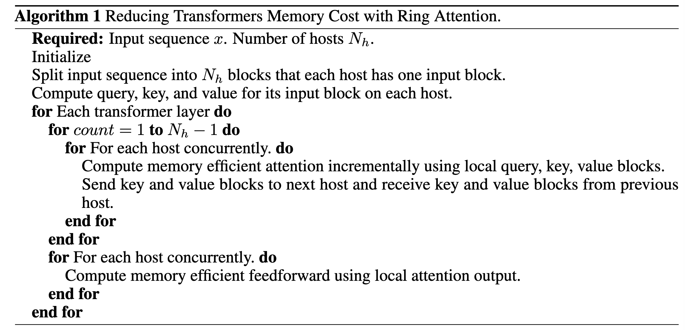

# Paper Summary

- Key points summarized for papers centered around distributed training

| Paper                                        | Parallelism Scheme                          | Overlap Scheme                                               |
| :------------------------------------------- | ------------------------------------------- | ------------------------------------------------------------ |
| [Megatron-LM](#megatron)                     | Tensor Parallelism                          | No overlap                                                   |
| [Reducing Activation Recomputation](#reduce) | Sequence Parallelism + Activation Recompute | No overlap                                                   |
| [DeepSpeed Ulysses](#deepspeed)              | Sequence Parallelism                        | No overlap                                                   |
| Centauri                                     |                                             |                                                              |
| [Ring Attention](#ringattn)                  | Sequence Parallelism                        | Overlap attention computation and communication of $K, V$ blocks |

## 1. Megatron-LM

### Model Parallelism

- MLP
  1. In first GEMM, split weight marix $A$ along column and duplicate matrix $X$
  2. In second GEMM, split weight matrix $B$ along row

- Multi-head Attention
  1. Split each head with associated $Q, K, V$ along column
  2. Split weight matrix $B$ along row

### Communication Analysis

Shown below.

## 2. Reducing Activation Recomputation

Sequence Parallelism + Avtication Recomputation, with Tensor Parallelism

### Workflow

Tbd

### Analysis

Tbd

## 3. DeepSpeed Ulysses

### Workflow

- Partition in _sequence_ dimension of the input embedding matrix and get $Q, K , V$ matrices with matmul
- Before attention module, _alltoall_ communication
  - Partition from sequence dimension to embedding dimension for each device (necessity comes from the multi-head attention design)
- After attention module, _alltoall_ communication, and then MLP matmul, layernorm etc.
  - Partition from embedding dimension to sequence dimension for each device 

### Communication Analysis

- $N$ - sequence length
- $h$ - hidden size
- $P$ - #GPU
- This work
  - before attention communicaiton: $3Nh/P$ per link
  - after attention communication: $Nh/P$ per link
  - total: $4Nh/P = O(N/P)$
  - Pros: remain constant when $N$ and $P$ are increased proportionally --> support longer sequence with more GPUs
- Megatron-LM
  - $O(N)$
  - two all-gather with message volume of $Nh$
  - two reduce-scatter with the volume of $Nh$
  - Their cost of size $M$ remains $M$ when $P > 1$ instead of $M/P$

## 4. Ring Attention

### Preliminary

[Flash Attention](https://zhuanlan.zhihu.com/p/642962397)

Key insights: How to calculate softmax of one entire row iteratively with only partial entries of the row

### Workflow

- Partition the $Q, O$ matrices in _sequence_ dimension to blocks with block size $B_r \times d$
- Partition the $K, V$ matrices in _sequence_ dimension to blocks with block size $B_c \times d$
- Each GPU holds a block of $Q, O$
- $K, V$​ blocks are transmitted in a ring order among GPUs, so that each GPU can calculates and updates the corresponding output $O$ block (refer to flash attention on how to update iteratively)
- Compute the feedforward results

### Analysis

- Assume 
  - block size is $c \times d$ for all matrices
  - Bandwidth between hosts $B$
  - Each host $F$ FLOPS

- Calculation
  - $2dc^2$ FLOPs for $Q \times K^T$
  - $2dc^2$ FLOPs for $S \times V$
- Communication
  - Send $2cd$ bytes
  - Receive $2cd$ bytes
- Overlap Requirement
  - $4dc^2 / F \geq 4cd / B$
  - $c \geq F / B$
